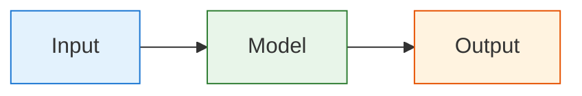
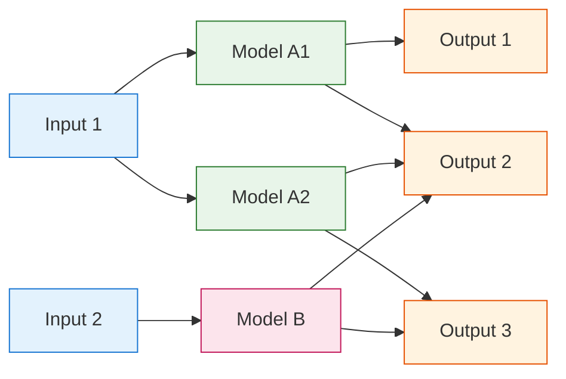

# AIS-catcher Architecture

AIS-catcher follows a modular architecture that can scale from simple to complex configurations. Let's explore both scenarios:

## Basic Architecture

In its simplest form, AIS-catcher processes data through three main stages:

Input: Single data source (e.g., an SDR device)
Model: Message decoding and processing
Output: Delivery of decoded messages (e.g., to screen)

## Advanced Architecture
For more complex setups, AIS-catcher supports multiple inputs with input-specific models:

In this advanced setup:
Inputs

Multiple input sources operate independently
Each input can use multiple specialized models
Examples: RTL-SDR, Airspy, network streams, files

Models

Input 1 uses two parallel models (A1 and A2)
Input 2 uses a single dedicated model (B)
Models are optimized for their specific input source

Outputs

Each model can send data to multiple outputs
Outputs can receive data from multiple models
Examples: screen display, file logging, network streaming, database storage

Configuration
Each component can be configured independently:

Input Configuration: Configure devices, files, and network sources
Model Configuration: Adjust signal processing and decoding parameters
Output Configuration: Set up various output formats and destinations

This modular architecture allows for flexible setups ranging from simple single-channel monitoring to complex multi-receiver systems with diverse output requirements.

