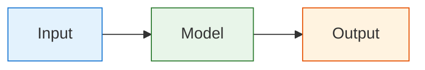
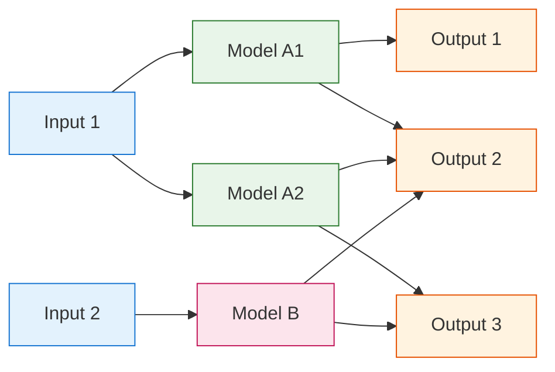

# AIS-catcher Architecture

## Usage Profiles

AIS-catcher follows a modular architecture that can scale from simple to complex configurations to cater for various use cses.

**Receiver**

Minimal options for decoding and output 

**Aggregator** 

Route and filter streams to aggregators

**Database**

Log all messages to PostgreSQL 

**Experimenter**

Simultaneous SDRs, decoder testing

**Web Viewer**

Display vessels via built-in web interface

## Basic Data Flow

In its simplest form, AIS-catcher processes data through three main stages:

## Documentation Structure

The documentation is organized along these lines.

[***Input***](input/overview.md)  

Examples: RTL-SDR, Airspy, network streams, files.

[***Model***](model.md)  

Message decoding and processing. AIS-catcher includes various decoding models for experimentation.

[***Output***](output/overview.md)  

Examples: screen display, file logging, network streaming, database storage

## Advanced Architecture
For more complex setups, AIS-catcher supports multiple inputs with input-specific models:

In this advanced setup: Multiple input sources operate independently. Each input can use multiple specialized models for decoding.  Each model can send data to one or more multiple outputs.
