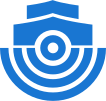

#  AIS-Catcher

**AIS-Catcher** is free and open-source software that turns an inexpensive **Software Defined Radio** (SDR) into a complete **AIS** receiver: receive and visualize ship traffic on a live map, and share the data over the network or with the community. The source code is available on [GitHub](https://github.com/jvde-github/AIS-catcher) under the **GPLv3** license.

[Get Started](getting-started/overview.md){ .md-button .md-button--primary }
[What do I need?](what-you-need.md){ .md-button .md-button--secondary }
[What is AIS?](ais-basics.md){ .md-button .md-button--secondary }

!!! warning "Disclaimer"
    **AIS-Catcher is intended for hobbyist and research projects only. It is NOT approved for use in navigation or safety-of-life applications.** [Read the full disclaimer](disclaimer.md).

## Resources

- [**Quick Start Guide**](https://www.aiscatcher.org/quickstart): From zero to a running station in six steps — install, then finalize the configuration in the browser.
- [**Complete User Guide**](getting-started/overview.md): Detailed instructions and feature walkthroughs.
- [**Community and Support**](community.md): Join the AIS-Catcher community at [aiscatcher.org](https://aiscatcher.org) to track your station's performance, share insights and get help.
- [**AIS Basics**](ais-basics.md): An introduction to the Automatic Identification System.
- [**Features**](getting-started/features.md): A complete overview of AIS-catcher's capabilities.
- [**FAQ**](faq.md): Answers to frequently asked questions.
- [**References**](references/overview.md): Links to additional resources and documentation.

