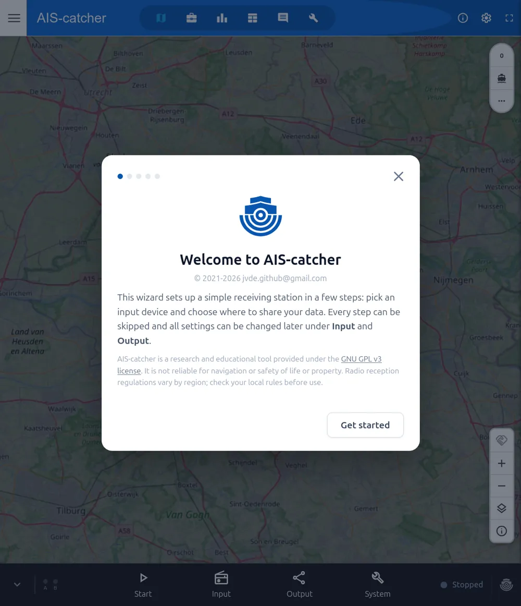
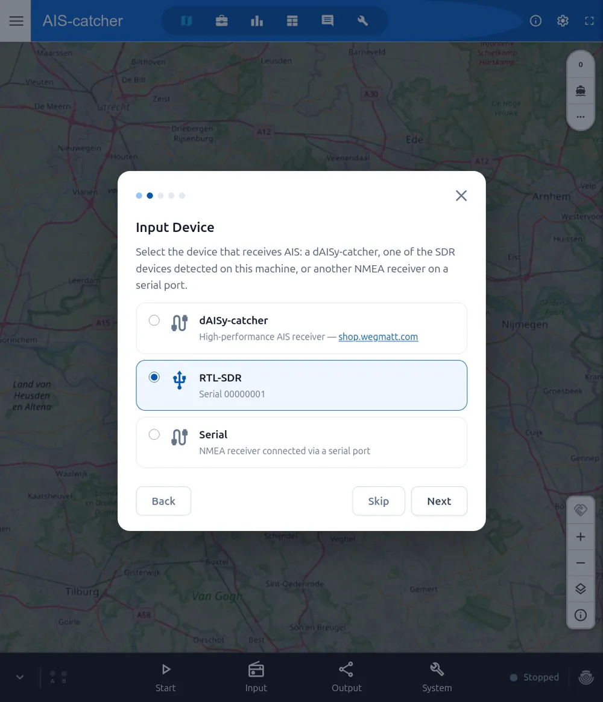
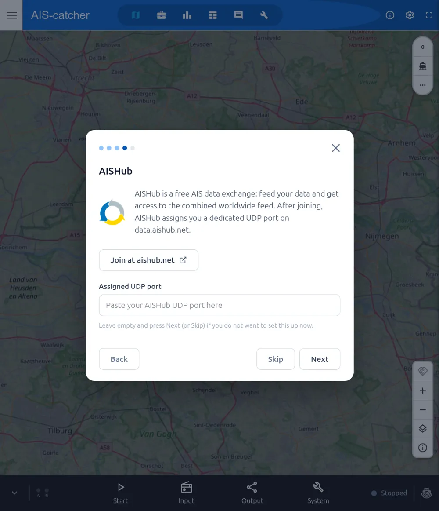
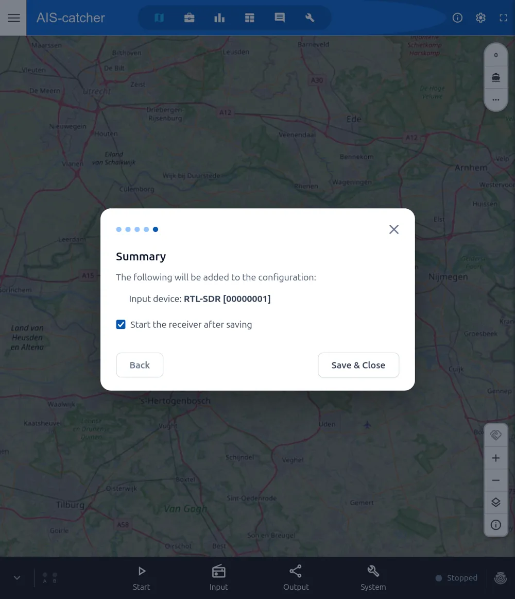
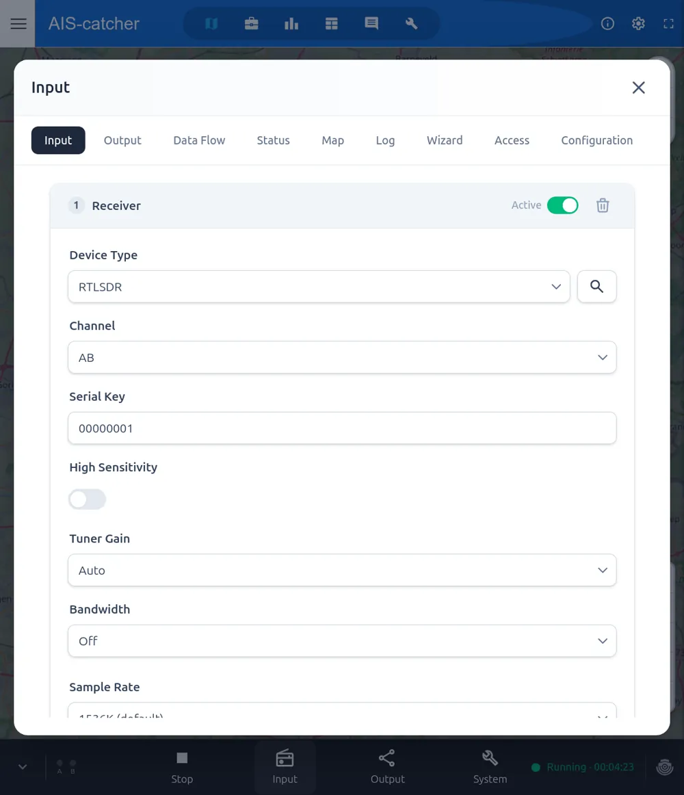
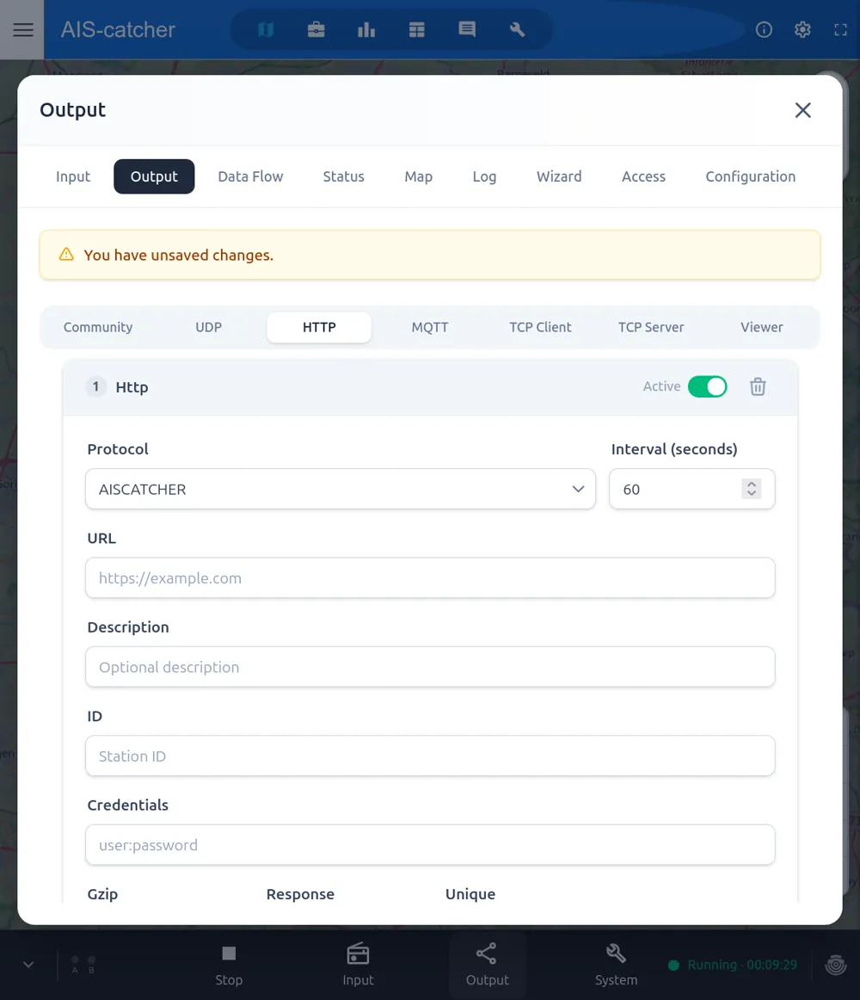

# Online Configuration

AIS-catcher includes a built-in **control panel**: a web interface from which you set up and manage your complete station — input device, decoder settings and all outputs — directly from the browser. A short setup wizard guides you through the first run, and afterwards every setting can be fine-tuned from the panel's **Input** and **Output** tabs.

This is the recommended way to configure AIS-catcher for new users: install AIS-catcher following the [installation instructions](../installation/overview.md) for your platform, start it with the control panel enabled, and finalize the configuration in the browser as described on this page.

> The built-in control panel is available in the **Edge** build and releases after v0.70. It is a lighter alternative to the separate [AIS-catcher-control](gui.md) package, which additionally offers host-level management (service control, one-click updates, reboot) on Raspberry Pi and Debian-based systems.

## Starting AIS-catcher with the Control Panel

The control panel is activated with the `-E` switch:

```console
AIS-catcher -E [config file] [bind address:port]
```

For example:

```console
AIS-catcher -E /tmp/aiscatcher.json 127.0.0.1:8118
```

Both arguments are optional: the config file defaults to `config.json` in the current directory, and the listen address defaults to `127.0.0.1:8118` (local access only).

In this *managed mode* all settings live in the specified JSON configuration file, which is created and maintained by the control panel — no other command-line options are accepted. The panel starts and stops the receiver for you, so there is no need to restart the program when you change settings.

The platform installation pages show the appropriate way to start on each system:

- **Raspberry Pi / Ubuntu / Debian** — the [install script](../installation/raspberrypi.md) with the `-M` option sets up a background service running in managed mode.
- **Windows** — double-click [`start-GUI.bat`](../installation/windows.md) in the unzipped folder.
- **Docker** — run the container with the [`-E` arguments](../installation/docker.md#docker-with-built-in-control-panel).
- **macOS / build from source** — start the binary [directly with `-E`](../installation/macos.md).

## Opening the Control Panel

Open the control panel in a browser:

```
http://localhost:8118
```

From another device on your network, use the receiver's address instead, e.g. `http://192.168.1.50:8118` or `http://raspberrypi.local:8118` — this requires AIS-catcher to be bound to `0.0.0.0` (see [Remote Access](#remote-access-and-security) below).

## Setup Wizard

On first use, a short setup wizard walks you through the configuration:

1. **Welcome** — read the intro and press **Get started**. You can skip the wizard at any time and change everything later.

    

2. **Pick your input device** — choose your RTL-SDR (detected automatically), a dAISy-catcher, or another serial receiver.

    

3. **Enable output sources** (optional) — share your data to pre-defined feeds like [aiscatcher.org](https://aiscatcher.org) and AISHub. Leave blank and press **Skip** to set this up later.

    

4. **Save & Close** — review the summary. With *Start the receiver after saving* ticked, AIS-catcher starts automatically.

    

Your station is now running. Anything the wizard set up can be fine-tuned later from the control panel's **Input** and **Output** tabs.

## Input and Output Tabs

> After changing anything, press **Save**, then **Restart the receiver** for the changes to take effect.

**Input** — adjust the receiver: device type, channels, tuner gain, sample rate, bandwidth and high-sensitivity mode.



**Output** — add or edit where your data goes: the community feed, UDP, HTTP, MQTT or TCP. For example, an HTTP feed is defined with its protocol, URL and posting interval.



## Remote Access and Security

By default the control panel is only reachable from the machine AIS-catcher runs on (`127.0.0.1`). To administer it from another machine on your network, bind to all interfaces:

```console
AIS-catcher -E /tmp/aiscatcher.json 0.0.0.0:8118
```

When bound to anything other than `127.0.0.1`/`localhost`, a **password is required**: on first access the panel asks you to set one, and every subsequent session requires logging in.

> The control panel is intended for use on your local network. If you want to expose your station's data publicly, do not expose the control panel — share your data via the [community feed](../configuration/output/community-feed.md) or the web viewer instead.

## Quick Start

For a complete guided walk-through — from hardware to a running station sharing data with the community — see the [Quick Start on aiscatcher.org](https://www.aiscatcher.org/quickstart).
